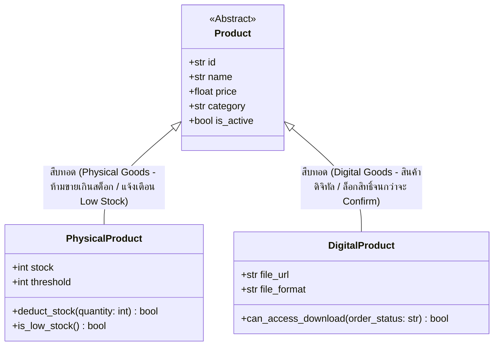

# 📦 Smart Inventory & E-Book Management System (Team 13)

[](https://github.com/FirstXCH/team-13-inventory/actions)
[](https://www.python.org/)
[-brightgreen.svg)](tests/)
[](src/)
[](LICENSE)

---

### 📋 ข้อมูลโครงงานและข้อมูลรายวิชา (Course & Team Info)
* **รหัสวิชา:** [31-407-102-302]
* **ชื่อวิชา:** วิศวกรรมซอฟต์แวร์ (Software Engineering) | หน่วยกิต: (2-1-3)
* **กลุ่มเรียน:** ECP3N | ห้องเรียน: ECP 321
* **อาจารย์ผู้สอน:** อาจารย์ ดร.ปิยะนุช ตั้งกิตติพล
* **ชื่อโครงงาน:** ระบบจัดการคลังสินค้าอัจฉริยะและหนังสือดิจิทัล (Smart Inventory Management System — Team 13)
* **ผู้จัดทำและผู้นำเสนอ:** นายกานต์นิธิ ยะโส รหัสนักศึกษา 67332110223-9 กลุ่ม ECP3N
* **โครงงานฐานข้อมูลที่เชื่อมโยง (Database Project):** ระบบร้านขายหนังสือและอีบุ๊กออนไลน์ (Lampara Books)
  * GitHub: [https://github.com/FirstXCH/BookSell-DatabaseProject](https://github.com/FirstXCH/BookSell-DatabaseProject)
  * Live Website: [https://lampara-books.vercel.app](https://lampara-books.vercel.app)

---

## 🗺️ แผนผังเอกสารส่งตรวจประเมินตามเกณฑ์ (Deliverables Map)

เพื่อให้ผู้สอนสามารถตรวจประเมินตามเกณฑ์ 20 คะแนนได้อย่างสะดวก รวดเร็ว และเป็นระบบ:

| หมวดหมู่การประเมิน | เอกสารทางการใน Repository | สาระสำคัญ |
|---|---|---|
| **1. Spec & User Story (4 คะแนน)** | [`specs/spec.md`](specs/spec.md) | ขอบเขตระบบ, User Stories, และ Acceptance Criteria (Given-When-Then) |
| **2. Software Diagrams (4 คะแนน)** | [`diagrams/class.md`](diagrams/class.md)<br>[`diagrams/sequence.md`](diagrams/sequence.md) | Class Diagram และ Sequence Diagram (ไม่มีการส่ง ERD แทน Class Diagram) |
| **3. งานฝั่งผู้ใช้ UX (3 คะแนน)** | [`docs/ux/persona.md`](docs/ux/persona.md)<br>[`docs/ux/accessibility.md`](docs/ux/accessibility.md) | Persona ผู้ใช้ และผลตรวจ Accessibility พร้อมจุดแก้เป็นข้อๆ (WCAG 2.1 AA) |
| **4. Automated Test & CI (4 คะแนน)** | [`tests/test_inventory.py`](tests/test_inventory.py)<br>[`.github/workflows/ci.yml`](.github/workflows/ci.yml) | Unit Test รันผ่านจริง 6 เคส (100%) และ GitHub Actions CI รันบน Pull Request |
| **5. บันทึก AI & จริยธรรม (3 คะแนน)** | [`docs/team/AI_ITERATION_LOG.md`](docs/team/AI_ITERATION_LOG.md) | บันทึก Prompt, จุดที่ปฏิเสธข้อเสนอ AI พร้อมเหตุผล, และประเด็น PDPA |
| **6. โค้ดระบบหลัก** | [`src/models.py`](src/models.py)<br>[`src/service.py`](src/service.py)<br>[`src/notifiers.py`](src/notifiers.py) | รองรับสินค้า 2 ชนิด (Physical ตัดสต็อก vs Digital ล็อกดาวน์โหลด) ตามหลัก Clean Architecture |

<details>
<summary><b>📖 คู่มือการเตรียมตัวสอบและทบทวนเนื้อหาแบบ Step-by-Step (Local Study Guide)</b> <i>[คลิกเพื่อขยาย]</i></summary>

> *หมายเหตุ: ไฟล์ `STEP_01` ถึง `STEP_08` เป็นคู่มือเตรียมตัวสอบส่วนบุคคล จัดเก็บไว้ใช้งานในเครื่อง (Local)*

| ขั้นตอน (Step) | เอกสารและหัวข้อ | รายละเอียดเนื้อหา | วัตถุประสงค์เพื่อการนำเสนอ |
|:---:|---|---|---|
| **STEP 01** | ภาพรวมโครงการและสถาปัตยกรรม | ที่มา ปัญหา ขอบเขตระบบ Clean Architecture และ 3-Tier Layer | อธิบายภาพรวม Business Domain และ High-Level Architecture |
| **STEP 02** | ข้อกำหนดความต้องการระบบ (SRS) | Functional Requirements, Non-Functional, User Stories & Acceptance Criteria | ชี้แจงขอบเขตฟังก์ชันระบบและการวัดผลคุณภาพ |
| **STEP 03** | การออกแบบคลาสและโมเดล | UML Class Diagram, Sequence Diagram, Design Patterns (Observer, Strategy) | ตอบคำถามเรื่อง OOP, Polymorphism และการขยายระบบ |
| **STEP 04** | โครงสร้างโค้ดและการแยกเลเยอร์ | โค้ดใน `src/` (`models.py`, `service.py`, `notifiers.py`), Separation of Concerns | อธิบายหลักการเขียนโค้ด การแยกหน้าที่ และ Dependency Inversion |
| **STEP 05** | การทดสอบระบบอัตโนมัติ | ชุดทดสอบ Pytest 6 กรณีทดสอบ (Boundary, Negative, Business Logic) ผ่าน 100% | สาธิตการทำ Automated Unit Testing และ CI/CD Pipeline |
| **STEP 06** | การออกแบบ UX และการเข้าถึง | Personas, User Journey, มาตรฐานการเข้าถึง WCAG 2.1 AA, Contrast Ratio | แสดงถึงความเข้าใจกลุ่มผู้ใช้งานและการออกแบบ Inclusive Design |
| **STEP 07** | บันทึกการใช้ AI และรีวิวระบบ | Responsible AI Usage, AI Iteration Logs, Security Prompting & Guardrails | ตอบคำถามเรื่องการใช้ AI อย่างรับผิดชอบและตรวจสอบโค้ด |
| **STEP 08** | สรุปผลการทำงานเป็นทีมและสปรินต์ | Agile Scrum, Sprint Retrospective 1, Burn-down Chart, Action Items | สรุปผลการจัดการโครงงานและการปรับปรุงกระบวนการพัฒนา |

</details>

---

## 🏛️ สถาปัตยกรรมระบบและกฎทางธุรกิจ (Architecture & Business Logic)

ระบบ Inventory นี้ได้รับการออกแบบเชิงวัตถุ (Object-Oriented Design) เพื่อรองรับสินค้า 2 ประเภทที่มีกฎทางธุรกิจต่างกันโดยสิ้นเชิง:



```text
                      ┌────────────────────────────────────┐
                      │            <<Abstract>>            │
                      │              Product               │
                      ├────────────────────────────────────┤
                      │ + id: str                          │
                      │ + name: str                        │
                      │ + price: float                     │
                      │ + category: str                    │
                      │ + is_active: bool = True           │
                      └────────────────────────────────────┘
                                         ▲
                                         │ (Inheritance)
                   ┌─────────────────────┴─────────────────────┐
                   │                                           │
┌─────────────────────────────────────┐     ┌─────────────────────────────────────┐
│           PhysicalProduct           │     │           DigitalProduct            │
├─────────────────────────────────────┤     ├─────────────────────────────────────┤
│ + stock: int                        │     │ + file_url: str                     │
│ + threshold: int = 5                │     │ + file_format: str = "PDF"          │
├─────────────────────────────────────┤     ├─────────────────────────────────────┤
│ + deduct_stock(qty: int): bool      │     │ + can_access_download(              │
│ + is_low_stock(): bool              │     │     order_status: str): bool        │
├─────────────────────────────────────┤     ├─────────────────────────────────────┤
│ [Business Rules / กฎธุรกิจ]           │     │ [Business Rules / กฎธุรกิจ]           │
│ • ตัดสต็อกตามยอดสั่งซื้อ                  │     │ • ไม่ตัดสต็อก (Zero Stock)             │
│ • ห้ามขายเกินสต็อก (ValueError)        │     │ • ล็อกสิทธิ์ดาวน์โหลดจนกว่า               │
│ • เตือนเมื่อ stock <= threshold        │     │   order_status = Confirmed/Paid     │
└─────────────────────────────────────┘     └─────────────────────────────────────┘
```

### 1. สินค้าทางกายภาพ (Physical Goods: หนังสือรูปเล่ม)
* **การตัดสต็อก:** ทุกครั้งที่มีการสั่งซื้อ ระบบจะลดค่า `stock` ตามจำนวนที่ซื้อ
* **Validation:** หากจำนวนสั่งซื้อมากกว่าสต็อกคงเหลือ ระบบจะโยน `ValueError('ยอดสต็อกไม่เพียงพอ')`
* **Low Stock Observer:** เมื่อยอดคงเหลือต่ำกว่าหรือเท่ากับ `threshold` ระบบจะส่งสัญญาณเตือนไปยัง `InventoryNotifier` ทันที

### 2. สินค้าดิจิทัล (Digital Goods: อีบุ๊ก/ไฟล์ PDF)
* **Zero Physical Stock:** สินค้าประเภทนี้ไม่มีวันหมดสต็อก (`stock` เป็น `None`) จึงไม่ถูกตัดยอด
* **Fulfillment & Access Control:** มีระบบความปลอดภัยควบคุมลิงก์ดาวน์โหลด โดยลิงก์จะถูก **ล็อก (Locked)** ในสถานะ `Pending` และจะปลดล็อกให้เข้าถึงไฟล์ได้เฉพาะเมื่อคำสั่งซื้อเป็น **Confirmed** เท่านั้น

---

## 🧪 การทดสอบระบบอัตโนมัติ (Automated Testing with Pytest)

ระบบมีชุดทดสอบอัตโนมัติครอบคลุม 6 Test Cases สำคัญตามเกณฑ์วิศวกรรมซอฟต์แวร์:

```bash
# ติดตั้ง pytest (หากยังไม่ได้ติดตั้ง)
pip install pytest

# รันชุดทดสอบพร้อมรายงานผลแบบละเอียด
pytest tests/ -v
```

### ผลการทดสอบ (Test Results: 100% Passed):
```text
============================= test session starts =============================
platform win32 -- Python 3.12.3, pytest-9.1.1, pluggy-1.6.0
rootdir: team-13-inventory
plugins: anyio-4.13.0
collected 6 items

tests/test_inventory.py::test_physical_product_stock_deduction PASSED    [ 16%]
tests/test_inventory.py::test_physical_product_cannot_sell_beyond_stock PASSED [ 33%]
tests/test_inventory.py::test_digital_product_no_stock_deduction PASSED  [ 50%]
tests/test_inventory.py::test_digital_product_download_locked_when_pending PASSED [ 66%]
tests/test_inventory.py::test_digital_product_download_unlocked_when_confirmed PASSED [ 83%]
tests/test_inventory.py::test_low_stock_notification PASSED              [100%]

============================== 6 passed in 0.02s ==============================
```

---

## 📁 โครงสร้างไดเรกทอรีของโครงงาน (Project Structure)

```text
team-13-inventory/
├── .github/
│   └── workflows/
│       └── ci.yml                     # ระบบ CI/CD ทดสอบโค้ดอัตโนมัติบน GitHub Actions
├── diagrams/                          # แผนภาพการออกแบบระบบ
│   ├── class.md                       # UML Class Diagram (Mermaid & PlantUML)
│   └── sequence.md                    # Sequence Diagram
├── docs/                              # เอกสารคู่มือและการออกแบบ
│   ├── images/                        # ไฟล์รูปภาพประกอบ
│   │   └── sprint_board.png           # รูปภาพ Sprint Task Board & Burndown
│   ├── team/                          # เอกสารการจัดการทีม
│   │   ├── TEAM_CHARTER.md            # กฎบัตรทีมและบทบาทหน้าที่
│   │   ├── RETRO-SPRINT-1.md          # รายงานการประเมินผลสปรินต์ที่ 1
│   │   └── AI_ITERATION_LOG.md        # บันทึกการสร้างโค้ดด้วย AI
│   └── ux/                            # การออกแบบ UX และความพร้อมเข้าถึง
│       ├── accessibility.md           # การวิเคราะห์ WCAG 2.1 AA
│       └── persona.md                 # ข้อมูลกลุ่มเป้าหมายผู้ใช้งาน
├── specs/                             # ข้อกำหนดทางเทคนิค
│   └── spec.md                        # Software Requirements Specification
├── src/                               # ซอร์สโค้ดภาษา Python (Clean Architecture)
│   ├── models.py                      # โมเดลข้อมูล (PhysicalProduct, DigitalProduct)
│   ├── service.py                     # Business Logic (InventoryService)
│   ├── notifiers.py                   # แจ้งเตือน Low Stock (Observer Pattern)
│   └── inventory.py                   # Inventory Controller
├── tests/                             # ชุดทดสอบอัตโนมัติ
│   └── test_inventory.py              # Automated Unit Tests (6 Cases)
├── .ai-rules.md                       # ข้อกำหนดการควบคุมการใช้ AI ในทีม
├── .gitignore                         # กำหนดไฟล์ที่ไม่ติดตามใน Git (รวมไฟล์ study guide ในเครื่อง)
└── README.md                          # เอกสารภาพรวมหลัก (หน้านี้)
```

---

## 👥 สมาชิกทีมและบทบาท (Team 13 Members & Roles)
* **นายกานต์นิธิ ยะโส (รหัสนักศึกษา 67332110223-9)**
  * **Role:** Scrum Master / Backend & Database Developer
  * **Responsibilities:** ออกแบบโครงสร้างระบบ, พัฒนา Core Inventory Logic, เขียน Automated Test Suites, ดูแล CI/CD และเอกสารวิศวกรรมซอฟต์แวร์
* ดูรายละเอียดสมาชิก กฎระเบียบทีม และข้อตกลงการทำงานได้ที่ [docs/team/TEAM_CHARTER.md](docs/team/TEAM_CHARTER.md)

---
*จัดทำขึ้นสำหรับการศึกษาและส่งผลงานในรายวิชาวิศวกรรมซอฟต์แวร์ (Software Engineering) ปีการศึกษา 2026*
