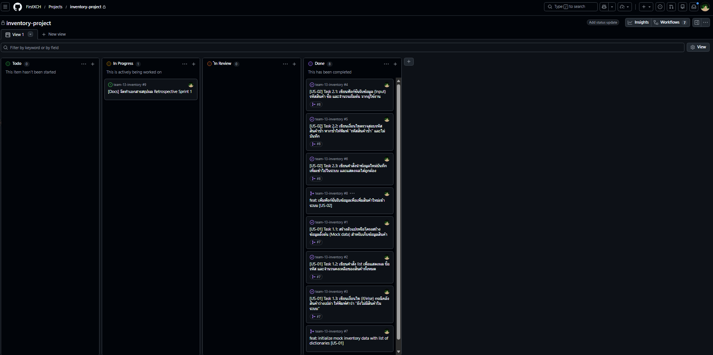

# 👥 STEP 08: การทำงานเป็นทีม (Team Charter) และสรุปบทเรียนสปรินต์ (Sprint Retrospective)

# TEAM_CHARTER.md

## สมาชิกและบทบาท

| ชื่อ | GitHub Username | บทบาท |
|---|---|---|
| กานต์นิธิ ยะโส  | FirstXCH             | Product Owner / Developer |
| ธนวัฒน์ นามเหง้า  | tanawatnm             | Scrum Master / Developer |
| ณปวร เกิดคำ  | noppraworn.ke             |  Developer |

## Branching Strategy

ทีมใช้ GitHub Flow:
- main branch ต้อง deploy ได้เสมอ ห้าม commit โดยตรง
- ทุก feature ใหม่ต้องสร้าง branch ชื่อ feat/<issue-number>-<short-name>
- ทุก PR ต้องมีคนอื่นในทีมอย่างน้อย 1 คน review และ approve ก่อน merge

## เพดานงานที่ทำพร้อมกัน (WIP limit)

- คอลัมน์ In Progress มีการ์ดพร้อมกันได้ไม่เกิน 2 ใบ
- เมื่อชนเพดาน ห้ามลากการ์ดใหม่เข้ามา ให้ช่วยกันปิดของเดิมหรือรีวิว PR ที่ค้างใน In Review ก่อน
- ปรับเพดานระหว่าง sprint ได้ แต่ต้องเขียนเหตุผลกำกับไว้ท้ายหัวข้อนี้ ไม่ใช่ปรับเพราะการ์ดล้น

## Sprint Goal (Sprint 1)

Sprint นี้ทีมเราจะพัฒนาระบบคลังสินค้าพื้นฐาน โดยเน้นส่งมอบฟีเจอร์การเรียกดูรายการสินค้าคงเหลือ (US-01) และการเพิ่มสินค้าใหม่เข้าระบบพร้อมระบบป้องกันการกรอกรหัสซ้ำ (US-02) ให้สามารถทำงานได้จริงและผ่าน Acceptance Criteria อย่างครบถ้วน

## AI Usage Policy

- ใช้ AI ช่วยเขียน draft code และ draft commit message ได้
- ทุก commit message ที่ AI generate ต้องอ่านและแก้ให้ตรงกับ diff จริงก่อน commit
- ห้าม copy code จาก AI โดยไม่อ่านและทำความเข้าใจก่อน
- ใช้เฉพาะ AI ที่ไม่มีค่าใช้จ่าย ไม่บังคับซื้อ subscription

---

# Sprint Retrospective: Sprint 1

## Velocity
- Story point ที่วางแผน: 10 (US-01 รวม 4 แต้ม, US-02 รวม 6 แต้ม)
- Story point ที่ทำสำเร็จ (Done): 10
- Velocity Sprint 1: 10 points

## เพดานงานที่ทำพร้อมกัน (WIP limit)
- เพดานที่ตั้งไว้ใน TEAM_CHARTER.md: 2 ใบ
- ชนเพดานกี่ครั้งใน sprint นี้: 0 ครั้ง (ทุกคนรับงานคนละ 1 ใบ ไม่เกินที่ตั้งไว้)
- เพดานที่จะใช้ใน sprint หน้า: 2 ใบ เพราะ เป็นตัวเลขที่พอดีกับจำนวนสมาชิกทีม 2 คน ทำให้ทุกคนโฟกัสงานของตัวเองได้เต็มที่โดยไม่เกิดคอขวด

## Start: สิ่งที่ควรเริ่มทำในรอบต่อไป
1. ควรตกลงและแบ่งงานกันให้ชัดเจนตั้งแต่เริ่ม Sprint เพื่อไม่ให้เกิดการสับสนว่าใครจะหยิบ Task ไหน
2. ควรแตกงาน (Task) ให้ละเอียดกว่านี้ เพื่อให้แต่ละ Issue มีขนาดเล็กลงและตรวจ (Review) ได้ง่ายขึ้น

## Stop: สิ่งที่ควรหยุดทำ
1. หยุดเขียนโค้ดรวดเดียวจนจบแล้วค่อย Commit ควรหันมาทยอย Commit ทีละฟังก์ชันย่อยๆ
2. หยุดนำโค้ดขึ้น (Push) โดยยังไม่ได้ทดสอบรันในเครื่องตัวเองให้เรียบร้อยก่อน

## Continue: สิ่งที่ทำได้ดี ควรทำต่อ
1. การช่วยกันรีวิวโค้ดและคอมเมนต์ใน Pull Request ก่อนกด Merge ถือว่าทำได้ดีมากและช่วยลดข้อผิดพลาด
2. การใช้ GitHub Projects จัดการสถานะงาน (To Do -> In Progress -> In Review -> Done) ทำให้เห็นภาพรวมชัดเจน

## AI Commit Audit
- **PR ของ US-02:** ข้อความที่ AI ร่างมาให้ในช่วงแรกบอกแค่ว่า "ทำอะไร" (What) แต่ไม่ได้บอก "ทำไปทำไม" (Why) ทีมจึงต้องปรับแก้ข้อความ Commit ใหม่ให้มีบริบทอธิบายเหตุผลของการดักจับรหัสสินค้าซ้ำ เพื่อให้ตรงกับกฎการเขียน Commit

## Action Item สำหรับ Sprint ถัดไป
| Action | เจ้าของ |
|---|---|
| ทบทวนคำสั่ง Git ขั้นพื้นฐานให้แม่นยำขึ้น | ทุกคนในทีม |
| ศึกษาการใช้งานไลบรารีเพิ่มเติมเพื่อลดเวลาในการเขียนโค้ดลอจิก | KANNITI YASO (FirstXCH) |

---
### 

