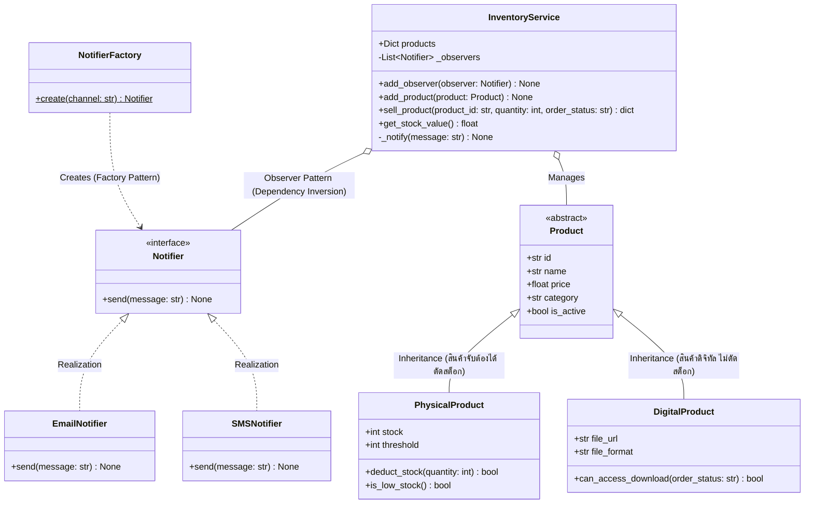

# Class Diagram: ระบบจัดการคลังสินค้า (Inventory System)
รองรับสินค้า 2 ชนิด (Physical Goods & Digital Goods) และการแจ้งเตือนตามหลัก SOLID

## เหตุผลการออกแบบตามหลัก Software Engineering
1. **Open/Closed Principle (OCP)**: สามารถขยายชนิดสินค้าใหม่ได้ (เช่น สินค้าบริการ Subscription) โดยการสืบทอดจาก `Product` โดยไม่ต้องแก้โค้ดคำนวณเดิม
2. **Dependency Inversion Principle (DIP)**: `InventoryService` ขึ้นกับ `Notifier` Interface ไม่ได้ผูกติดกับ Email หรือ SMS โดยตรง
3. **Single Responsibility Principle (SRP)**: แยกการประมวลผลสต็อก (`PhysicalProduct`) ออกจากการตรวจสอบสิทธิ์ดาวน์โหลดไฟล์ (`DigitalProduct`)
