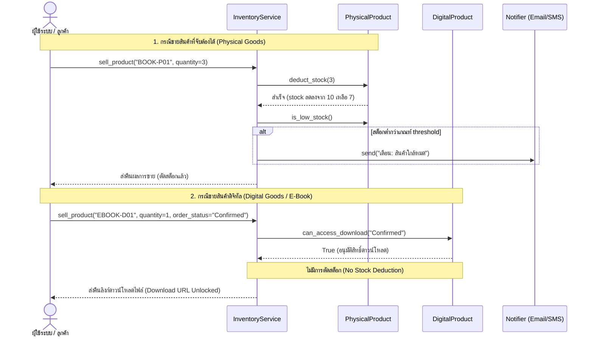

# Sequence Diagram: กระบวนการขายและการจัดการสินค้า 2 ชนิด

```mermaid
sequenceDiagram
    actor Client as ผู้ใช้ระบบ / ลูกค้า
    participant Service as InventoryService
    participant Phys as PhysicalProduct
    participant Dig as DigitalProduct
    participant Observer as Notifier (Email/SMS)

    %% กรณีที่ 1: การขายสินค้าจริง (Physical Product)
    Note over Client, Phys: 1. กรณีขายสินค้าที่จับต้องได้ (Physical Goods)
    Client->>Service: sell_product("BOOK-P01", quantity=3)
    Service->>Phys: deduct_stock(3)
    Phys-->>Service: สำเร็จ (stock ลดลงจาก 10 เหลือ 7)
    Service->>Phys: is_low_stock()
    alt สต็อกต่ำกว่าเกณฑ์ threshold
        Service->>Observer: send("เตือน: สินค้าใกล้หมด")
    end
    Service-->>Client: ส่งคืนผลการขาย (ตัดสต็อกแล้ว)

    %% กรณีที่ 2: การขายสินค้าดิจิทัล (Digital Product)
    Note over Client, Dig: 2. กรณีขายสินค้าดิจิทัล (Digital Goods / E-Book)
    Client->>Service: sell_product("EBOOK-D01", quantity=1, order_status="Confirmed")
    Service->>Dig: can_access_download("Confirmed")
    Dig-->>Service: True (อนุมัติสิทธิ์ดาวน์โหลด)
    Note over Service, Dig: ไม่มีการตัดสต็อก (No Stock Deduction)
    Service-->>Client: ส่งคืนลิงก์ดาวน์โหลดไฟล์ (Download URL Unlocked)
```
